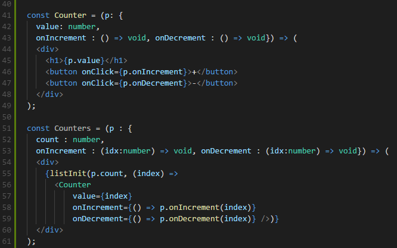

- title : HTML & JavaScript Ecosystem
- description : A brief introduction into the JavaScript ecosystem (NPM, Webpack, React)
- author : Matthias Dittrich, Johannes Baeurle
- theme : league
- transition : default

***

## A brief introduction into the JavaScript ecosystem (NPM, Webpack, React)


### **Matthias Dittrich & Johannes Baeurle**, AIT GmbH <br /> [@matthi\_\_d](http://twitter.com/matthi__d) [@JoBaeurle](http://twitter.com/JoBaeurle) | [github matthid](https://github.com/matthid) [github JohBa](https://github.com/JohBa) | [aitgmbh.de](http://www.aitgmbh.de/)

***

### Roadmap

 - **JavaScript**
 - NPM
 - Webpack
 - JavaScript - Wat?

---

### In the beginning was...

```html
<html>
<head>
  <title>xyz</title>
  <link rel="stylesheet" href="style.css" type="text/css" media="screen" />
  <script type='text/javascript' src='index.js'></script>
</head>
<body>

</body>
```

```js
console.log("hiho");
```

' einfaches javascript
' Einbindung File in HTML File

---

### Oldschool Way

```html 
<html>
<head>
  <meta http-equiv="Content-Type" content="text/html; charset=UTF-8" />
  <title>xyz</title>
  <link rel="stylesheet" href="style.css" type="text/css" media="screen" />
  <link rel='stylesheet' id='wpfb-css'  href='wp-filebase.css' type='text/css' media='all' />
  <script type='text/javascript' src='jquery.js?ver=1.12.4'></script>
  <script type='text/javascript' src='jquery-migrate.min.js?ver=1.4.1'></script>
  <script type='text/javascript' src='jquery.easing.min.js?ver=1.4.1'></script>
  <script type='text/javascript' src='jquery.mousewheel.min.js?ver=3.1.13'></script>
  <script type='text/javascript' src='react.js'></script>
  <script type='text/javascript' src='moment.min.js'></script>
  .
  .
  .
  <script type='text/javascript' src='index.js'></script>
</head>
```
' Vorgehen: neue library ziehen, einbinden (bei jedem update!)
' Javascript früher: vielleicht ein paar Events, Button Clicks, kleine Änderungen am Dom
' Javascript heute: macht fast "alles", dynamisch content nachladen, etc.

---

### Managing dependencies?

- Referencing other servers?
- Downloading and adding .js files by hand?
- Scale?


***

### Roadmap

 - JavaScript
 - **NPM**
 - Webpack
 - JavaScript - Wat?

---

### NPM (node package manager)!

- Part of a nodejs installation
- **No longer required to manually download `*.js` files**
- `packages.json`, `node_modules`


---

### First steps with npm
```
npm init
npm install react --save
npm install webpack --save-dev
```

' init erzeugt ein einfaches packages.json file mit infos für npm
' --save installiert dependency für production
' --save-dev für development

---

### Packages.json

```
{
  "name": "empty-client",
  "version": "1.0.0",
  "description": "",
  "main": "index.js",
  "scripts": {
    "test": "echo \"Error: no test specified\" && exit 1"
  },
  "author": "",
  "license": "ISC",
  "dependencies": {
    "react": "^16.4.1",
    "react-dom": "^16.4.1",
    "typesafe-actions": "^2.0.4"
  },
  "devDependencies": {
    "typescript": "^2.9.2",
    "webpack": "^4.12.0"
  }
}

```

---

### Growing ecosystem?

- Lots of small javascript files
- Speed issues (loading lots of javascript files)

***

### Roadmap

 - JavaScript
 - NPM
 - **Webpack**
 - JavaScript - Wat?

---

### node_modules, and now?

```html 
<html>
<head>
  <meta http-equiv="Content-Type" content="text/html; charset=UTF-8" />
  <title>xyz</title>
  <link rel="stylesheet" href="style.css" type="text/css" media="screen" />
  <script type='text/javascript' src='node_modules/jquery/jquery.js'></script>
  <script type='text/javascript' src='node_modules/react/react.js'></script>
  <script type='text/javascript' src='node_modules/moment/moment.min.js'></script>
  .
  .
  .
  <script type='text/javascript' src='index.js'></script>
</head>
```

' händisch suchen und runterladen nicht mehr möglich
' immer noch händische einbindung..?
' für jedes file eigener request
' mobil? datentraffic?

---

### Import

```js
import React from "react";
```

' EcmaScript6 erlaubt import, früher require
' nodejs löst abhängigkeit auf, preprocessor kann auf eine einzelne bündeln

---

### Webpack!

"bundle" the javascript application into a single file an minimize download.

tree shaking

"build system"


' mächtig!
' viele plugins/loader um Entwicklung zu unterstützen
' macht aus vielen js dateien eine bundle datei mit allem
' nur noch ein request für alles js
' tree shaking: ungenutzte module werden ausgelassen

---

### Configure

```js
module.exports = {
    entry: "./src/index.js",
    output: {
        filename: "bundle.js",
        path: __dirname + "/dist"
    },

    resolve: {
        extensions: [ ".js", ".json"]
    }
};
```

---

### Loaders and Plugins

* Loaders
  * preprocess files, own loaders with node.js
* Plugins
  * "serve the purpose of doing anything else that a loader cannot do."

' Loaders kann man sich wie Tasks in build vorstellen
' webpack itself is built on the same plugin system that you use in your webpack configuration!
' Plugins machen alles was nicht mit loadern geht

---

### Loader

```js
module: {
    rules: [
        { 
          test: /\.tsx?$/, 
          loader: "awesome-typescript-loader"
        }
    ]
}
```

' loaders innerhalb rules liste
' test prüft auf .ts oder .tsx endung, Regex feld.

---

### Loader

```js
{
  test: /\.scss$/,
  use: [{
    loader: 'style-loader'
    }, {
    loader: 'css-loader'
    }, {
    loader: 'sass-loader'
  }]
}
```

```js
import './style.scss'
```

' css loading über javascript
' sass-loader transforms Sass into CSS.
' css-loader parses the CSS into JavaScript and resolves any dependencies.
' style-loader outputs our CSS into a style tag in the document.

---

### Plugin

```js
plugins:[
    new HtmlWebpackPlugin({
      title: 'Testpage'
    })
]
```

' Generiert automatisch eine index.html im output ordner
' fügt automatisch generierte bundle.js hinzu

---

### NPM & Webpack
Packages.json
```js
"scripts": {
    "start:dev": "webpack-dev-server --mode development",
    "start": "webpack --mode development",
    "build": "webpack --mode production",
    "test": "echo \"Error: no test specified\" && exit 1"
}
```

' scripts um nicht ständig riesige befehle per commandline eingeben zu müssen
' build bspw. starten oder für development app starten

***

### Roadmap

 - JavaScript
 - NPM
 - Webpack
 - **JavaScript - Wat?**

---

### JavaScript?

```js
[1,2,3,15,30,7,5,45,60].sort()
// = [1,15,2,3,30,45,5,60,7]
```


' keine typen, js nutzt string comparison
'  "1".charCodeAt(0) etc.

---

### Managing code bases?

- No compiler, no types
- no refactoring

-> Not possible to manage huge code bases

' IDE unterstützung bei renaming fehlt
' nach änderung quasi trial & error

---

### TypeScript!

- Superset of JavaScript
- Typed, feels like working with C#
- Refactoring
- Transpiles to plain JavaScript in the version you choose (ES5 is compatible with most browsers)


' fehler werden direkt rot in der IDE angezeigt (methode nicht gefunden etc.)

---

### Modern UI Development: React

- Separate application state from drawing
- do not split on technologies but on components!
- internal optimizations with virtual dom
- with great power comes great responsibility


' just look at the state
' Elmish

---




---

### Demo (POC CoreOsApps):

- npm
- webpack
- typescript
- fable
- react
- elmish

***

### Thank you!

* Too many sources, see Sources.txt
* Johannes, Matthias
