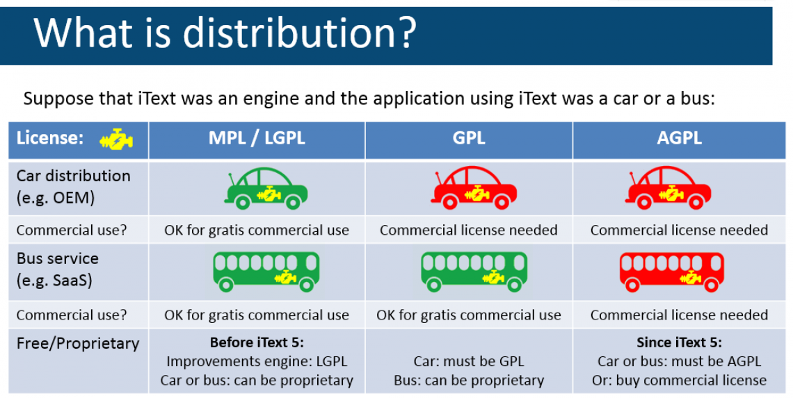
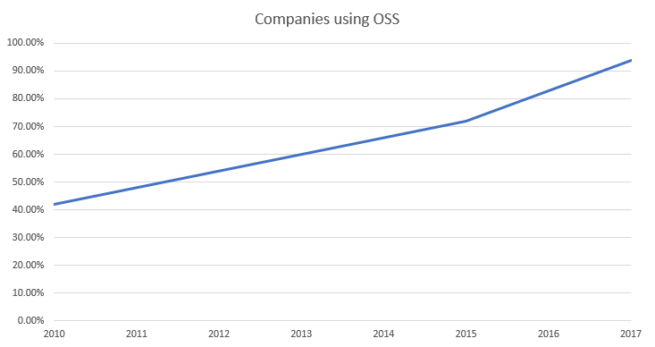
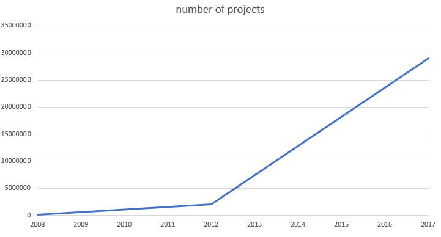
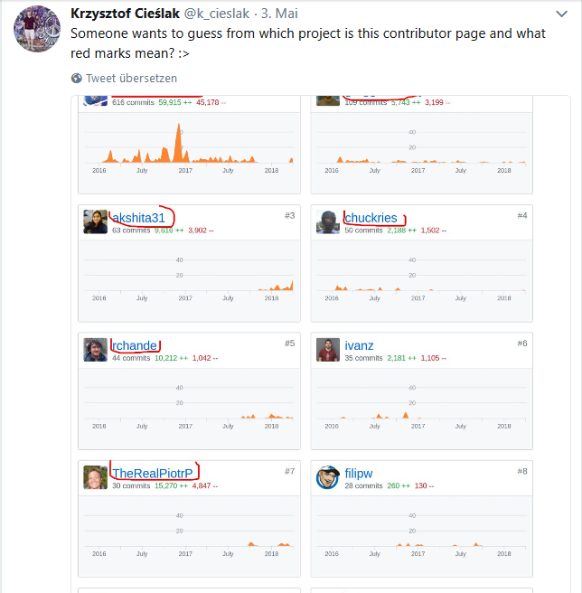
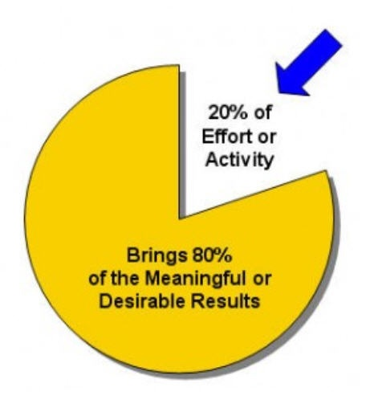
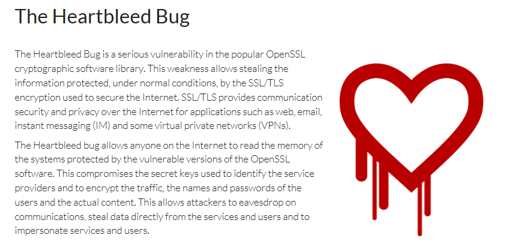
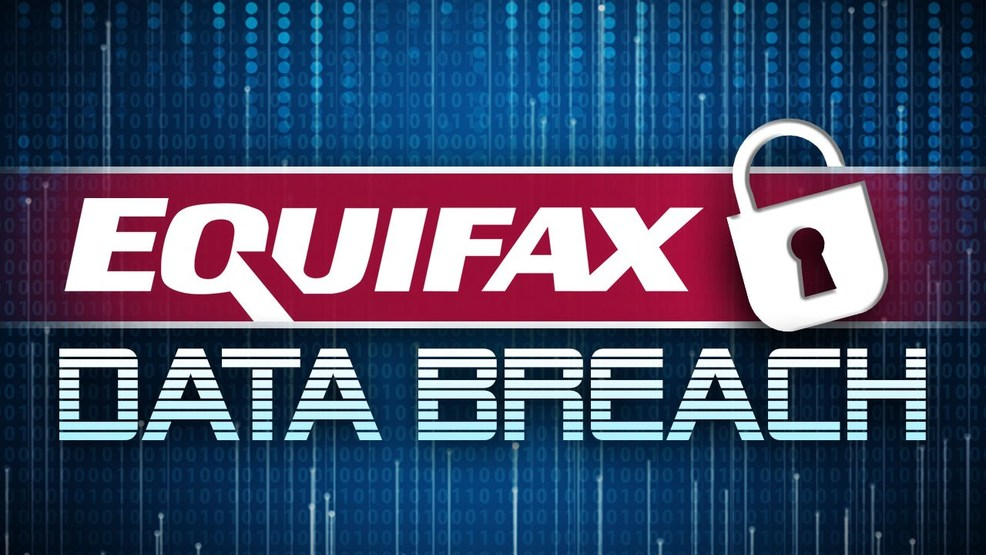

- title : HTML & JavaScript Ecosystem
- description : A brief introduction into HTML5 and the JavaScript ecosystem
- author : Matthias Dittrich, Johannes Baeurle
- theme : league
- transition : default

***

## Business in the post-OSS world


### **Matthias Dittrich & Johannes Baeurle**, AIT GmbH <br /> [@matthi\_\_d](http://twitter.com/matthi__d) [@JoBaeurle](http://twitter.com/JoBaeurle) | [github matthid](https://github.com/matthid) [github JohBa](https://github.com/JohBa) | [aitgmbh.de](http://www.aitgmbh.de/)

***

### Roadmap

 - **HTML**
 - JavaScript

---

### Under the hood

```html
<!DOCTYPE html>
<html>
  <head>
    <title>Beispiel</title>
  </head>
  <body>
    <h1>Beispiel</h1>
    <p>Das ist ein <a href="demo.html">einfaches</a> Beispiel.</p>
    <!-- dies ist ein Kommentar -->
  </body>
</html>
```

' xml
' elemente, attribute
' kein styling bis auf wenige ausnahmen

---

### Der DOM


Document Object Model

' Browser analysiert HTML
' Erstellen DOM im Arbeitsspeicher
' DOM Zugriff über bspw. javascript

---

###Head
```html
<head>
  <title>HTML head Elements</title>
  <meta charset="utf-8">
  <meta name="Keywords" content="HTML,...">
  <meta name="Description" content="Well...">
  <link rel="icon" href="/favicon.ico" type="image/x-icon">
  <link rel="stylesheet" href="/w3css/4/w3.css">
  <script async="async" type="text/javascript" src="w3schools.min.js"></script>
</head>
```
The `<head>` element is a container for metadata (data about data) and is placed between the `<html>` tag and the `<body>` tag.

HTML metadata is data about the HTML document. Metadata is not displayed.

---

###Body

The `<body>` tag defines the document's body.

The `<body>` element contains all the contents of an HTML document, such as text, hyperlinks, images, tables, lists, etc.

---

```html
<input placeholder="foo" id="test" type="text">
<button type="button">Button</button>
```
<input placeholder="foo" id="test" type="text">
<button type="button">Button</button>

---

```html
<h1>Header</h1>
<h2>Subheader</h2>
```
<h1>Header</h1>
<h2>Subheader</h2>

---

```html
<a href="http://google.com">Hyperlink</a>

```
<a href="http://google.com">Hyperlink</a>


---

```html
<a href="http://google.com">Hyperlink</a>

```
<a href="http://google.com">Hyperlink</a>


---

```html
<div>Hier könnte Ihre Werbung stehen!</div>
```
The `<div>` tag defines a division or a section in an HTML document.

The `<div>` element is often used as a container for other HTML elements to style them with CSS or to perform certain tasks with JavaScript.

' styling mit divs
' html dokument voller divs
' kaum lesbar
' früher table hell, dann div hell
' html5 macht (fast) alles besser

---

```html
<div id="header">
  Header
  <div id="nav">Menu</div>
</div>
<div id="wrapper">
  <div id="content">
    Inhalt
  </div>
  <div id="sidebar">
    Sidebar
  </div>
</div>
<div id="footer">Footer</div>
```

---

### HTML5 Semantic Web!
`<header>` `<nav>` `<section>` `<article>` `<aside>` `<footer>`

---

```html
<header>
  Header
  <nav>Menu</nav>
</nav>
<section>
  <article>
    Inhalt
  </article>
  <aside>
    Sidebar
  </aside>
</section>
<footer>Footer</footer>
```

---

### Styling?!
Cascading Style Sheets!

```css
body {
    background-color: lightblue;
}
h1 {
    color: white;
    text-align: center;
}
p {
    font-family: verdana;
    font-size: 20px;
}
```

' HTML nur Formattierung, wie dann Styling?
' CSS für styles, hintergrundfarbe, textfarbe, etc.!

---

### More?!
https://www.w3schools.com/html/default.asp
https://www.w3schools.com/css

---

### Demo!

---

***

### Roadmap

 - Was bisher geschah...
 - **Lizenzen und Ideale?**
 - Stand von OSS?
 - Warum OSS?
 - Oder doch nicht?
 - To be continued...

---

### "I'm not a lawer"

' Can only give some general ideas

---

### The four philosophies


' Open -> MIT/Apache 2.0
' LGPL -> Änderungen müssen zurückwandern, einbindung in kommerziellen Code möglich
' GPL -> Einbindung in kommerziellen Code nicht möglich
' AGPL -> Cloud!

---

### What the GPL?



***

### Roadmap

 - Was bisher geschah...
 - Lizenzen und Ideale?
 - **Stand von OSS?**
 - Warum OSS?
 - Oder doch nicht?
 - To be continued...

---

### Wer nutzt OSS?

---

# 100%

[of Fortune 500 companies using NPM](https://twitter.com/joemccann/status/821522254957658112)

--- 

## More companies



' Black Duck Software

--- 

## More projects



' SourceForge & GitHub

--- 

## $2,400,000,000

Venture capital investments into OSS focused companies in 2014

---

### Microsoft

"We use open source - along a lot of other reasons - to improve our internal work flow and cross project contributions"

*** 

### Roadmap

 - Was bisher geschah...
 - Stand von OSS?
 - Lizenzen und Ideale?
 - **Warum OSS?**
 - Oder doch nicht?
 - To be continued...

---

### Standards

"Open source software is usually easier to obtain than proprietary software, often resulting in increased use. Additionally, the availability of an open source implementation of a standard can increase adoption of that standard"

> http://dodcio.defense.gov/Open-Source-Software-FAQ/

' Standards schaffen
' Standards verdrengen

---

### Quality

"The OSS development approach has helped produce reliable, high quality software quickly and inexpensively."

> http://www.jmir.org/2011/1/e24/

---

### Innovation

"It is flexible because modular systems allow programmers to build custom interfaces, or add new abilities to it and it is innovative since open source programs are the product of collaboration among a large number of different programmers. The mix of divergent perspectives, corporate objectives, and personal goals speeds up innovation"

> Plotkin, Hal (December 1998)

---

### Security

"Moreover, free software can be developed in accord with purely technical requirements. It does not require thinking about commercial pressure that often degrades the quality of the software. Commercial pressures make traditional software developers pay more attention to customers' requirements than to security requirements, since such features are somewhat invisible to the customer."

> https://onlinelibrary.wiley.com/doi/abs/10.1046/j.1365-2575.2002.00118.x

' custom needs -> custom audit

---

### Sustainability

"Open source is not dependent on the company or author that originally created it. Even if the company fails, the code continues to exist and be developed by its users. Also, it uses open standards accessible to everyone; thus, it does not have the problem of incompatible formats that exist in proprietary software. "

***

### Roadmap

 - Was bisher geschah...
 - Stand von OSS?
 - Lizenzen und Ideale?
 - Warum OSS?
 - **Oder doch nicht?**
 - To be continued...

---

### Bazaar?


---

# 3%

of projects use the bazaar model. There is always someone in charge.

---

# 93%

of NPM packages with just one maintainer.

---

> I guess we all just need to hope that maintainers of those projects will never quit, get bored or decide that they have better things to do in their spare time…

---

## 1/2 of contributors only contribute once

They account for < 2% of commits.

---



---

### Risk?

- Using OSS powered by businesses
- Fixing bugs for free (compare with running license costs!)
  -> Hard to make transparent
- Buying SLAs from external consultings?
- Evaluation is hard
- "left-pad"?

---

### Vorteil proprietärer Software

- Direkter Ansprech- und Vertragsparter
- Alles aus einer Hand
- "Günstiger" als Beratung

---

"Businesses have a process for buying things they need."

"They don't have one for giving away things for free."

***

### Roadmap

 - Was bisher geschah...
 - Stand von OSS?
 - Lizenzen und Ideale?
 - Warum OSS?
 - Oder doch nicht?
 - **To be continued...**

---

### Business-Secrets?



' 80% digital infrastructure -> "no brainer"
' 20% business critical -> individuell

---

### Future

- recognize the importance of our "digital infrastructure"
- open market closed by new business ideas
- financial maintainer support or own developers
- working on open-source will be "the norm"
- businesses will learn to deal with it

' controlling the direction
' building own features

---



' BoringSSL (Google)

---



***

### Thank you!

* http://slides.com/k_cieslak/oss-3
* F# Community
* Wikipedia
* Johannes, Nico
