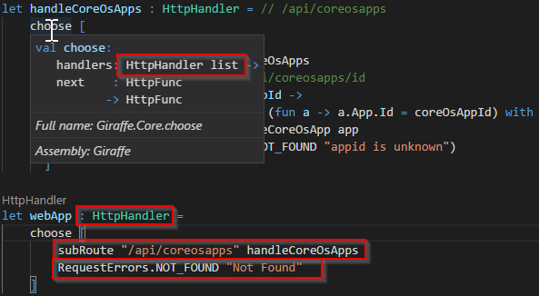

- title : ASP.Net & Fable
- description : Backend and Fable Frontend
- author : Matthias Dittrich
- theme : league
- transition : default

***

## ASP.Net Core Backend & Fable Frontend


### **Matthias Dittrich**, AIT GmbH <br /> [@matthi\_\_d](http://twitter.com/matthi__d) [github matthid](https://github.com/matthid) | [aitgmbh.de](http://www.aitgmbh.de/)

***

### Roadmap

 - **ASP.Net Core**
 - Fable 
 - Elmish

---

### .Net / .Net Core ???

framework available for both runtime.

originally from the ASP.Net team...

* more deployment options (docker)
* X-plat
* modularizarion -> size
* performance

---

### Self hosting

```csharp
    public static IConfiguration Configuration { get; set; }
    public static void Main(string[] args) {
        var builder = new ConfigurationBuilder()
            .SetBasePath(Directory.GetCurrentDirectory())
            .AddJsonFile("appsettings.json");

        Configuration = builder.Build();
        CreateWebHostBuilder(args).Build().Run();
    }
    public static IWebHostBuilder CreateWebHostBuilder(string[] args) =>
        WebHost.CreateDefaultBuilder(args)
        .UseUrls(Configuration["urls"])
        .UseStartup<Startup>();
```

---

### Configuration

```json
{
    "urls": "http://localhost:8082/"
}
```

Loosely coupled.

```csharp
        .UseUrls(Configuration["urls"])
```

POCO Object (strong type) possible: `IOption<MySetting>`

---

### Startup.cs

```
    public class Startup
    {
        public Startup(IConfiguration configuration)
        {
            Configuration = configuration;
        }

        public IConfiguration Configuration { get; }

        // This method gets called by the runtime.
        // Use this method to add services to the container.
        public void ConfigureServices(IServiceCollection services)
        {
            services.AddMvc()
                .AddJsonOptions(options =>
                {
                    // json options
                });
        }
```

' Setup DI Container with services
' Optional

---

### Configure

```csharp
    // This method gets called by the runtime.
    // Use this method to configure the HTTP request pipeline.
    public void Configure(IApplicationBuilder app, IHostingEnvironment env) {
        if (env.IsDevelopment()) {
            app.UseDeveloperExceptionPage();
        }
        else {
            app.UseHsts();
        }

        //app.UseHttpsRedirection();
        app.UseMvc();
    }
```

---

### Request pipeline

```csharp
public delegate Task RequestDelegate(HttpContext context);
public interface IApplicationBuilder {
  // ...
  IApplicationBuilder Use(Func<RequestDelegate, RequestDelegate> middleware);
}
```

Middleware is a high-order function ;)
Middleware gets the `next` function in the pipeline
Either handles the request, calls `next` or anything in between.

' Authentication/Authorization
' Setting variables in the pipeline

---


---

### Mvc (classic ASP.Net)

```csharp
    [Route("api/[controller]")]
    [ApiController]
    public class CoreOsAppsController : ControllerBase {
        // GET api/coreosapps
        [HttpGet]
        public ActionResult<IEnumerable<CoreOsApp>> Get() {
            // Set application/json?
            Response.ContentType = "application/json";
            return new ActionResult<IEnumerable<CoreOsApp>>(apps.Select(a => a.App));
        }
        
        // POST api/values
        [HttpGet("{id}/api/{*route}")]
        public void GetApi(string id, string route, [FromBody] string value) {
            // Call corresponding middlware component
        }
```

' Dependency injection of the "ConfigureServices"
' Mark via attributes

---

### Einschub Giraffe (F#)

```csharp
public delegate Task RequestDelegate(HttpContext context);
public interface IApplicationBuilder {
  // ...
  IApplicationBuilder Use(Func<RequestDelegate, RequestDelegate> middleware);
}
```

```fsharp
type HttpFuncResult = Task<HttpContext option>
type HttpFunc = HttpContext -> HttpFuncResult
type HttpHandler = HttpFunc -> HttpFunc
```

' Unterschied1: HttpContext passed along with the pipeline
' Unterschied2: cancellation / Noop because of "None"

---



```fsharp
let configureApp (app : IApplicationBuilder) =
    app.UseDefaultFiles()
       .UseStaticFiles()
       .UseGiraffe(webApp)
```

***

### Roadmap

 - ASP.Net Core
 - **Fable**
 - Elmish

---

### Fable

- F# to JavaScript
- Generates readable JavaScript
- Does NOT support all .NET APIs
- Embraces JavaScript Ecosystem

---

### JavaScript Ecosystem

- Some "core" .NET APIs are mapped for convenience
- FSharp.Core is mapped
- search on npm
  -> create bindings/imports/generate from typescript
  -> use library
- A lot of libraries have bindings ootb (just like typescript)

---

### C# -> F# quickstart

- Remove semicolons, braces and fix intendation
- Remove types (will be inferred most of the time)
- replace "var" with "let", "using" with "open"
- functions are "let" with arguments
- lambdas are `fun <Parameter1> <parameter2> -> <code>`
- a "module" is a static class
- `Func<T1, T1>` = `T1 -> T2`
- `void` is called `unit` or `()`
- no `return` as last value is the return

' Not technically accurate - conceptually

***

### Roadmap

 - ASP.Net Core
 - Fabl
 - **Elmish**

---

### Elmish


---

### Model / Messages

```fsharp
type Counter = int
type Model = Counter option
type Msg =
| Increment
| Decrement
| Init of Counter
```

---

### init

```fsharp
let init (_:CoreOsAppInit) : Model * Cmd<Msg> =
    let model = None
    let cmd = Cmd.ofMsg (Msg.Init (42))
    model, cmd
```

---

### update

```fsharp
let update (msg : Msg) (model : Model) : Model * Cmd<Msg> =
    let model' =
        match model,  msg with
        | Some x, Increment -> Some (x + 1)
        | Some x, Decrement -> Some (x - 1)
        | None, Init (Ok x) -> Some x
        | _ -> model
    model', Cmd.none
```

---

### view

```fsharp
let view (model : Model) (dispatch : Msg -> unit) : React.ReactElement =
    let centered =
        Content.Modifiers
           [ Modifier.TextAlignment (Screen.All, TextAlignment.Centered) ]
    let counterText =
        str ("Press buttons to manipulate counter: " + show model)
    let buttons =
        [ Column.column [] [ button "-" (fun _ -> dispatch Decrement) ]
          Column.column [] [ button "+" (fun _ -> dispatch Increment) ] ]
    div []
        [ Container.container []
              [ Content.content [ centered ]
                    [ Heading.h3 [] [ counterText ] ]
                Columns.columns [] buttons ]
        ]
```

---

### Helpers

```fsharp
let show model =
    match model with
    | Some x -> string x
    | None -> "Loading..."

let button txt onClick : React.ReactElement =
    Button.button
        [ Button.IsFullWidth
          Button.Color IsPrimary
          Button.OnClick onClick ]
        [ str txt ]
```

---

### Glue everything together

```fsharp
Program.mkProgram init update view
|> Program.withReact "elmish-app"
|> Program.run
```

Replaces `<div>` with id `"elmish-app"` just like the usual `React.Render`.

***

### Thank you!

* Too many sources, see Sources.txt
* Matthias
